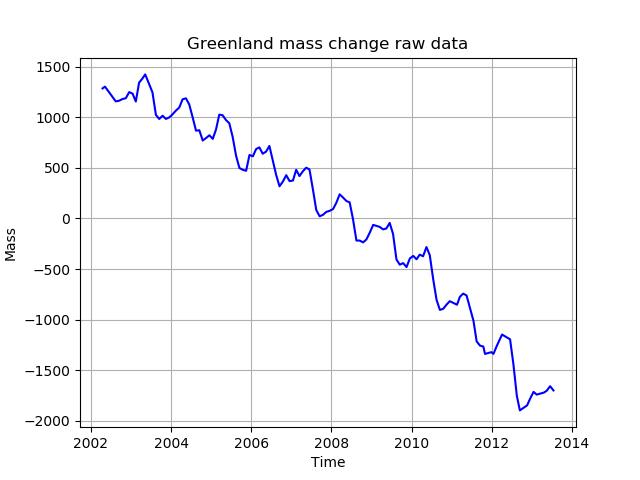
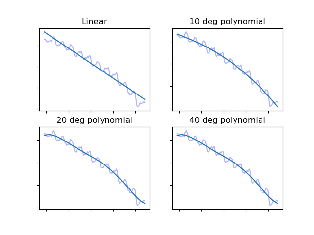
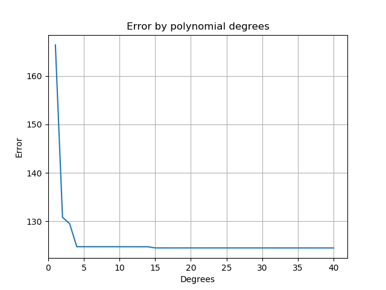
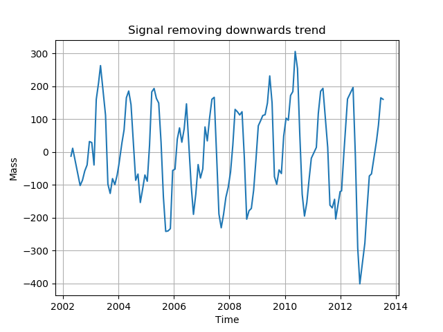
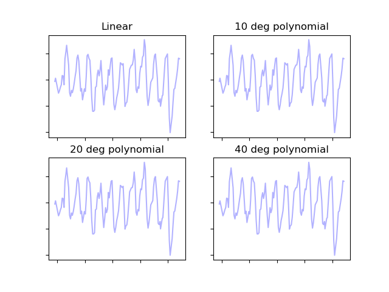

# Greenland climate change
## Predicting future mass of Greenland using statistical methods

This investigation uses a NASA [data source](http://climate.nasa.gov/system/internal_resources/details/original/499_GRN_ANT_mass_changes.csv) showing the mass of Greenland with time. Locally, I am storing it as [greenland-mass-change.csv](greenland-mass-change.csv).

The work largely demonstrates the dichotomy between bias (underfitting) and variance (overfitting). Typically it is more appropriate to deal with time-series data using something like Holt-Winters but that is for another day...

Below is a sample of the data taken a few years ago. See [sampled_data.py](sampled_data.py) to reproduce.

So how to best describe the trend of this data? We could use linear regression; a line of best fit, a polynomial regression with 2 degrees of freedom

### Trend fitting

By eye it is clear that linear fit would yield poor accuracy - it doesn't match the trend's shape - but clearly overfitting will be reached if we use a polynomial which can adjust very precisely to the graph's shape.

Produced by [under_overfit.py](under_overfit.py)

So which of these is the best curve? You can see that drawing a straight line through the data with linear regression, does not capture the downward curve of the trend. With the 40 degree curve, the tails curl biased by the last few data points which are likely to not match the general shape. The same is true of the 20&#176; model. How can we find a better way to find the closest fit to the data?

Before looking at the success (or error as is the preferred name) of each polynomial, we will first divide the data in to training and test portions. The curve we choose to represent the mass of Greenland will be made as if the date is 1 January 2012; a range from 2002 to 2011. We omit 2012 onwards to the remaining time can test how the predictions deviate from the real data collected by NASA. We now have a way. There will therefore be two types of error:
 - error of the training data - how closely a linear, simple quadratic or a quadratic with many degrees of freedom behaves when superimposed of the 2002 - 2011 data
 - test data error - having chosen the curve that best fits the data, how does it perform when we use it in the "future" i.e. 2012 onwards.

The below graph shows the error of each polynomial from 1 (linear regression) to a 40 degree polynomial testing just with the training data. It can be seen that the error of linear fit is the worst, 2 and 3 degree models are not great but after that a plateau is reached. 4 degrees of freedom seems to be the optimal solution at present: not overfitting and keeping to as few degrees as possible.

Measuring each model's error. Calculated by [polynomial_errors.py](polynomial_errors.py)

So having seen in the figure above that error when training decreases as we use more and more sophisticated smoothing we now need to evaluate these models on data that is new to them. Will a 14 degree polynomial behave more accurately on unseen data than a linear model and what is the optimal? As explained earlier, the unseen test data are all the data points from 2012 onwards.

Produced by [polynomial_errors_testing_eval.py](polynomial_errors_testing_eval.py)

As before the training data is shown, trending downwards with ever more complex models. The lower line shows how successful the respective models were at dealing with unseen data. I.e. the higher the value, the worse the model "guessed". So it can be seen that the worst of the tested models was the most complex. The best (identified as the lowest) point on the orange graph is at 2 degrees - a simple quadratic function when given new data to predict.

So we will use the 2 degree model found by the Python library NumPy. To nail down the quadratic explicitly we can retrieve the coefficients found by NumPy to be the best to match this data:

`-1.49674972e+01  5.98259947e+04 -5.97805224e+07`

i.e.   
&nbsp;&nbsp;&nbsp;&nbsp;&nbsp;&nbsp;y = -14.97x2  +  59830x  -  59780000

And just to prove there is nothing "up my sleeve", you can see these values being used in a simple [quadratic plot](quadratic_plot.py) demonstrating the shape matches the data we have.

### Seasonal fitting

We can now draw a line as appropriately as possible through the trend of Greenland's mass. If it weren't patently clear before; things are looking terrible for Greenland. But we want to predict the mass in March when things seem to be slightly better during a year and in September when each year's nadir is reached. To do this, we need to remove the trend effect to again make a model for the adjustment through each 12 month cycle. Below is a representation of the data without a trend.

Created using [seasonal_effect.py](seasonal_effect.py)

In the above figure the extremes can be seen to be growing: the minimum at the end of 2012 is identifiable in the source data as well as here. We now seek to repeat the process of finding the minimum test error after building a model with training data. Again the training data will be that until the end of 2011.

Here are some examples again of how different polynomials look when fitted to the seasonal data.

Produced with (seasonal_model_examples.py)[seasonal_model_examples.py]

Again the next task is to identify the best polynomial; the optimal degrees by finding the model with the lowest error on a test set of data (using the pre-2012 data for training).

In the figure immediately below we see the error in prediction for the 2012 onwards data for polynomial models with varying degrees of freedom.

Produced with (seasonal_effect_comparison.py)[seasonal_effect_comparison.py]
